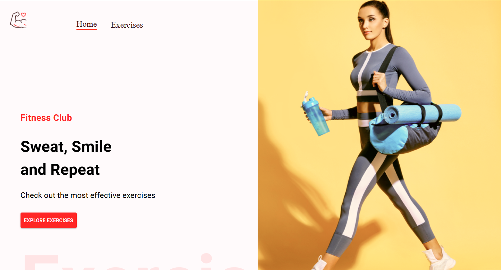
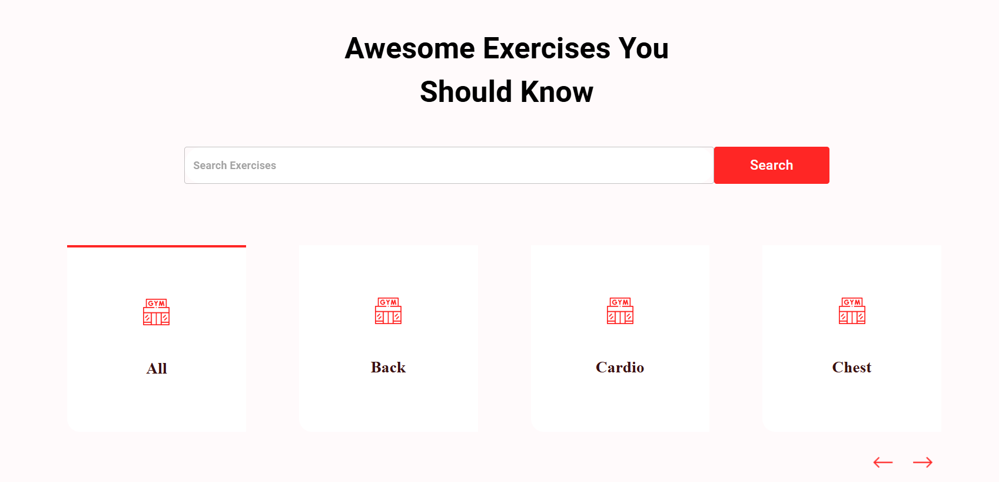
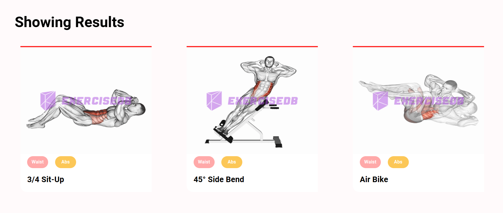
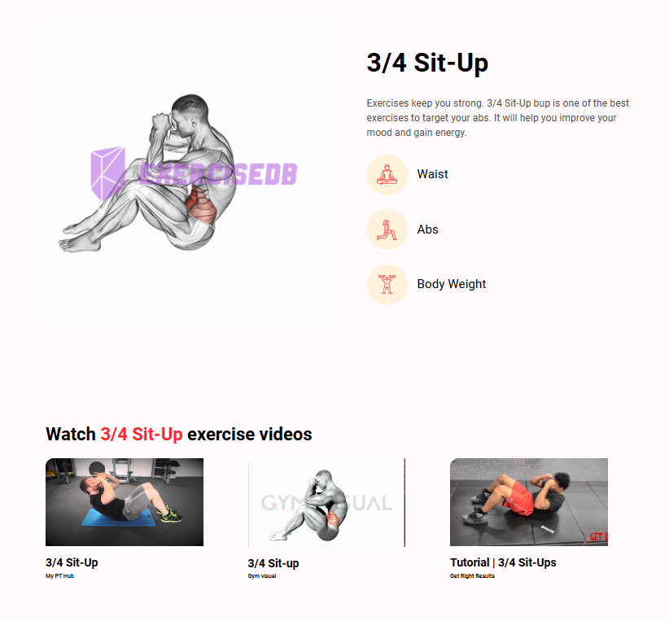

## Gold's Gym

Gold's Gym is a web application that allows users to explore various exercises targeting different body parts and provides instructional video tutorials for a comprehensive fitness experience.

🚀 Features
. Search Exercises: Easily find exercises based on specific muscle groups or equipment.
. Exercise Details: Detailed descriptions, including target muscles and equipment needed.
. Video Tutorials: Embedded video guides sourced from YouTube.
. Modern Design: Clean and responsive UI built with Material-UI.

🛠️ Built With
. React - For building the user interface.
. Vite - For fast builds and development.
. Material-UI - For responsive and styled UI components.
. RapidAPI ExerciseDB - Fetching exercise data.
. RapidAPI YouTube Search - Fetching exercise-related video tutorials.

📸 Screenshots

Homepage

Exercise Search

Exercises

Exercise Details

🌐 Live Demo

. Explore the live application here: [Gold's Gym Live](https://golds-gym-workouts.netlify.app/).

🛠️ Future Enhancements
 Personalized workout plans.
. User authentication for saving favorite exercises.
. Integrate additional features like calorie tracking or diet suggestions.
